# Infer-EDGE

# Benchmarking Experiments in Just-In-Time Edge Environments

To demonstrate the nature of DNN inference latency-energy-accuracy inter-conflict in just-in-time edge environments, we conducted benchmarking experiments on our lab testbed mimicking such environments. Specifically, we captured the characteristics of various versions of the same DNN and layer-specific attributes within each version during DNN inference and data transmission.

For the experiments, we used mostly video processing DNNs, namely VGG (Sengupta et al., 2019), ResNet (Targ et al., 2016), and DenseNet (Iandola et al., 2014), which are common for use cases employing just-in-time edge environments. 

For the testbed, we used an IoT device-edge server pair, where an NVIDIA Jetson TX2 mimics a computationally capable IoT device, and a Dell PowerEdge desktop with 16 cores and a CPU frequency of 3.2 GHz emulates the edge server. We observed processing outcome accuracy, end-to-end latency of processing all the layers of a DNN, and energy consumed by the IoT devices to study their inter-conflict.

## Observations on Model Architecture Optimization

As mentioned earlier, DNN model architecture optimization includes approaches such as model compression, model pruning/quantization, and early exit. However, all these strategies effectively generate multiple versions of a DNN model that vary in their characteristics and performance, even though the model objective stays the same. 

For the benchmarking experiments and in the rest of the paper, we thus used many versions of a particular DNN (e.g., VGG) as manifestations of different DNN model architecture optimization techniques.

In particular, we utilized the PyTorch implementations of different versions of the selected model: VGG11 and VGG19, ResNet18 and ResNet50, DenseNet121 and DenseNet161. The benchmarking process involved evaluating these models on the entire ImageNet dataset (Deng et al., 2009), and reporting the corresponding top-1 accuracy scores, inference latency, and energy consumption by Jetson TX2 (as shown in Table 1).

# Benchmarking Results

| Model       | Accuracy (acc1) | Latency (ms) | Energy (J) |
|-------------|------------------|--------------|------------|
| vgg11       | 69.04%           | 1044.48      | 6.17       |
| vgg19       | 72.40%           | 1862.89      | 11.83      |
| densenet121 | 74.43%           | 4292.17      | 28.00      |
| densenet161 | 77.11%           | 7845.49      | 50.99      |
| resnet18    | 69.76%           | 627.59       | 3.73       |
| resnet50    | 76.15%           | 984.62       | 7.46       |

*Table 1: Accuracy, Latency, and Energy Triangle benchmarked on ImageNet validation set.*

## Layerwise Latency Measurements and Latency Diversity Among Versions

As depicted in Figure 1, we conduct layerwise latency measurements for each version of the DNN models to evaluate differences in latency attributed to the computational complexity of individual layers. These measurements are performed on our testbed using 50 images from the ImageNet validation set. Both layerwise and cumulative latency across all layers are calculated.

For VGG models, as shown in Figure 2, we observe that VGG19 initially performs similarly to VGG11. However, as the model progresses, the computational cost of VGG19 surpasses that of VGG11, primarily due to its larger number of layers rather than the complexity of individual layers, thus depicting diverse layer characteristics among such models.

For the ResNet models, Figure 3 illustrates that ResNet18 exhibits higher computational complexity compared to ResNet50 in the initial layers. Despite ResNet50 having more convolutional layers, ResNet18 proves to be more computationally expensive. However, such patterns differ for the DenseNet models. Although both DenseNet121 and DenseNet161 have the same number of layers, as shown in Figure 4, layers 9 and 10 of DenseNet161 are found to be computationally more expensive, likely due to the presence of additional convolutional layers.

The overarching trend emerging from these observations is the latency diversity among layers between versions.

    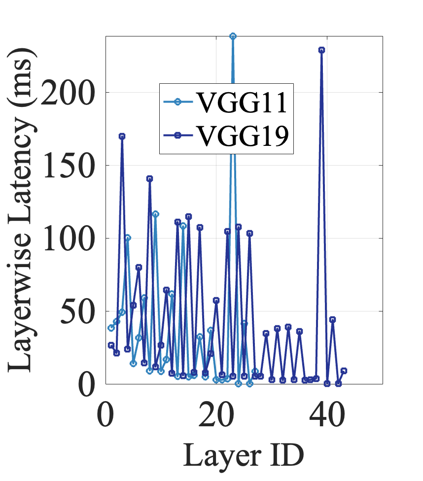
    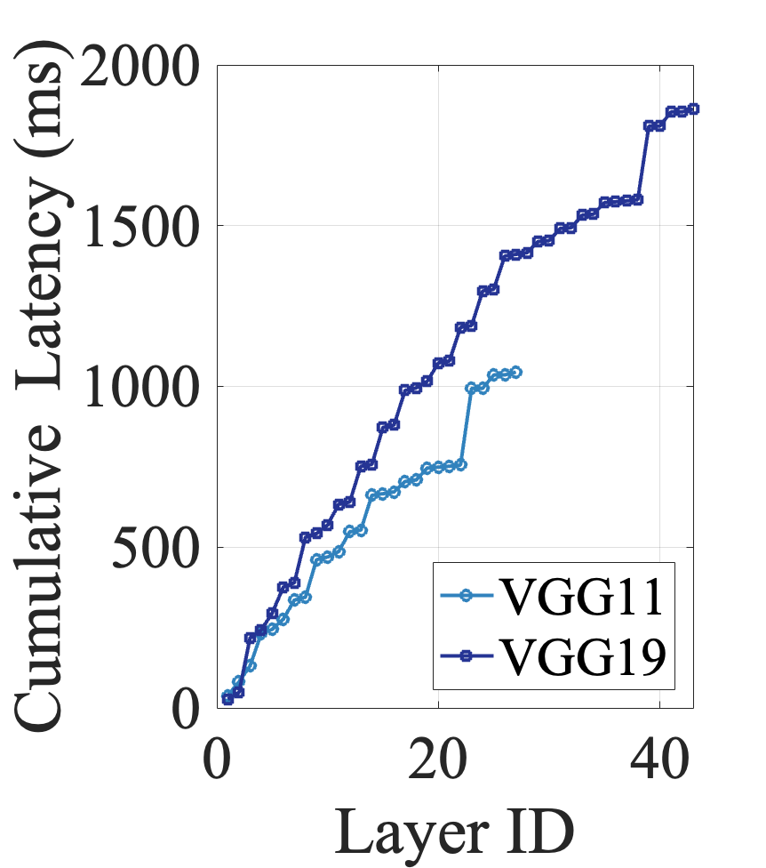
    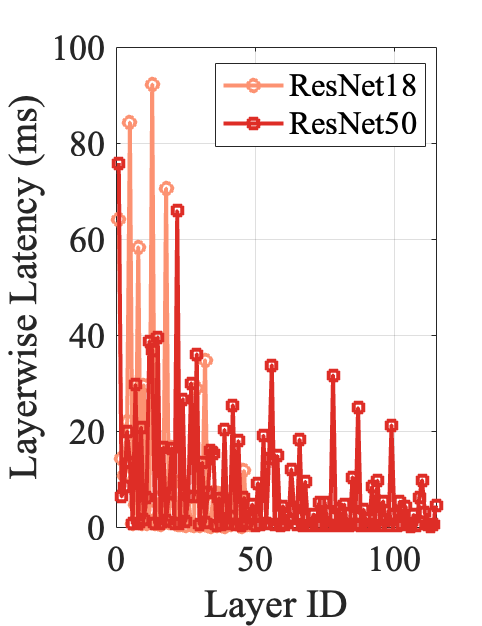
    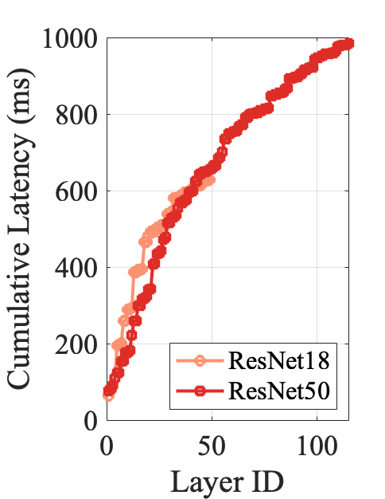
    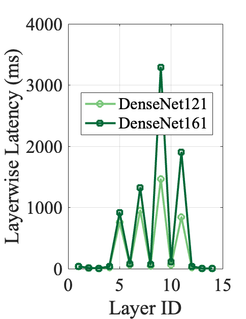
    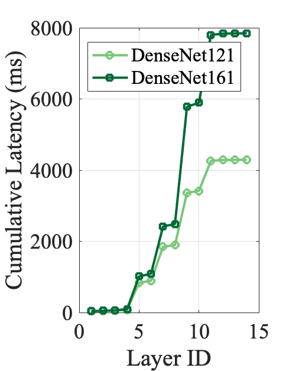

**Figure: Layerwise latency comparisons of different versions of VGG, ResNet, and DenseNet**

## Layerwise Performance Analysis for DNN Partitioning

Next, we perform experiments to observe layerwise performance in terms of output data size, computation latency, and cumulative energy consumed by the TX2 (i.e., IoT device) in order to ascertain layer choices for DNN partition.

It is to be noted that for this analysis, we primarily focus on the higher-level layers of the DNN models. For example, the number of convolutional layers in DenseNet versions exceeds 100. However, due to complex dependencies within the dense blocks, we avoid partitioning the DNN in the middle of the dense block, thereby limiting our analysis to the characteristics of the higher-level layers, which sum up to 14.

As for the output data size after different layers, in VGG11 (Fig. 1), we observe a favorable latency-to-output data size ratio in layers 3, 6, 11, and 27. However, this pattern shifts slightly in VGG19 (Fig. 2), where more efficient layers with respect to output size are 5, 10, 19, and 43. In ResNet (Figs. 3 and 4), on the other hand, the difference between versions lies in the additional layers towards the end. Consequently, potential cut points in ResNet18 are 3, 14, 19, and 49, while in ResNet 50, 3, 13, 20, and 115 appear to be the best options. However, for both ResNet and VGG, the cost of local processing before these potential cut points, particularly in terms of computational overhead, is significant. The layerwise latency and cumulative energy consumption of these models are plotted in Fig. 5 and Fig. 6.

DenseNet versions share the same potential cut points, which are 4, 6, 8, and 14, even though the size of output data is different.

    
    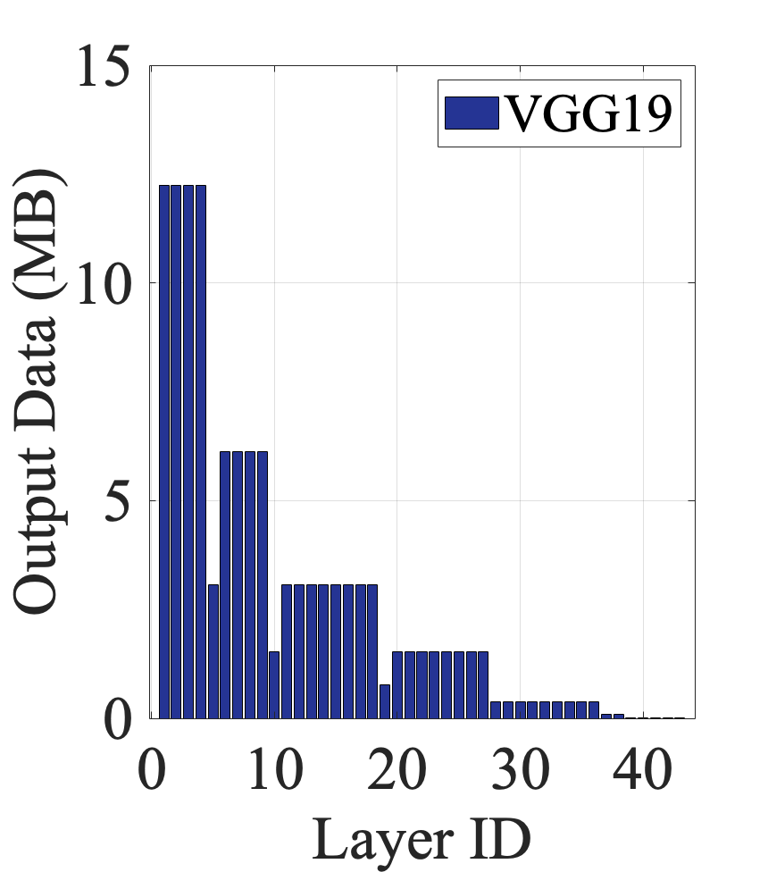
    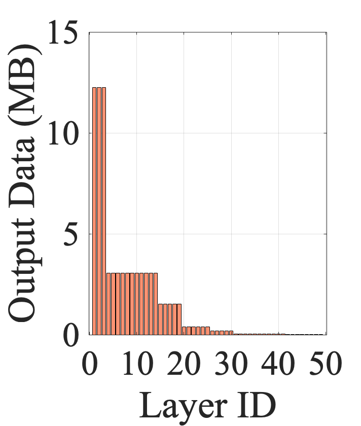
    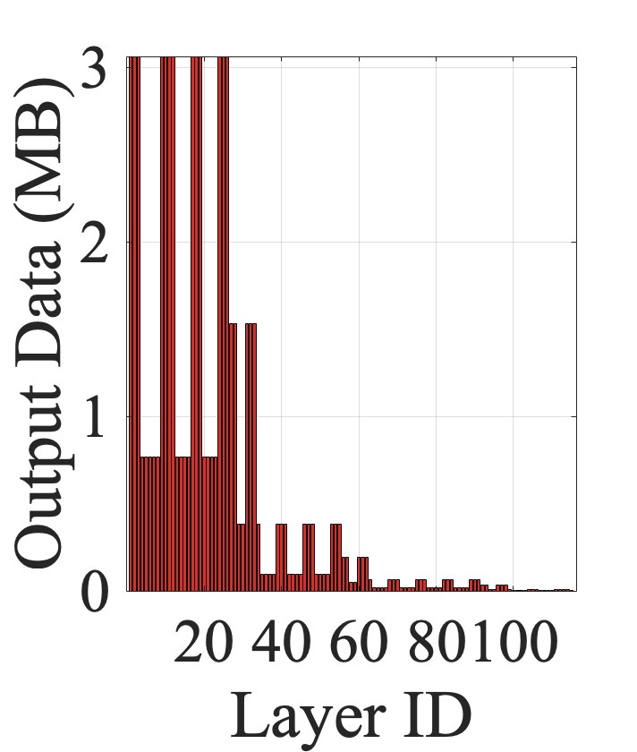
    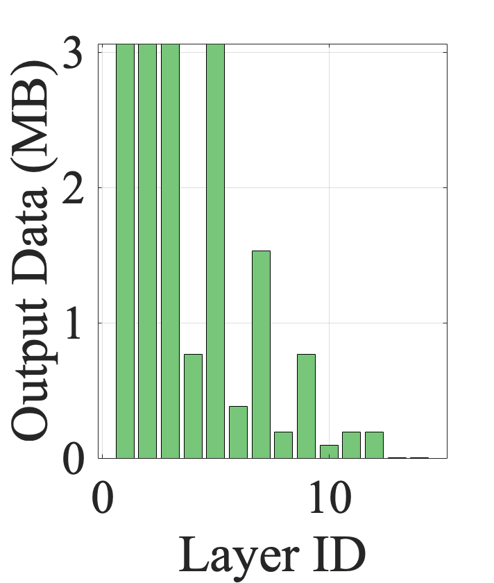
    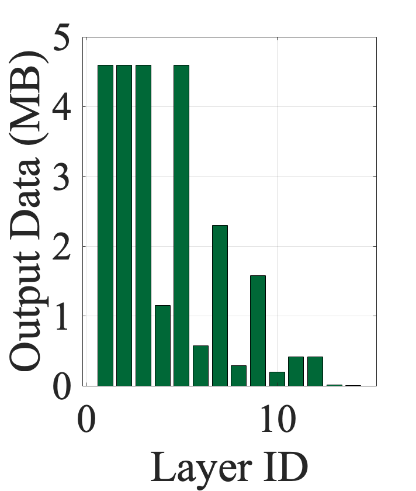

**Figure: Layerwise output data size comparisons of different versions of VGG, ResNet, and DenseNet**

    

        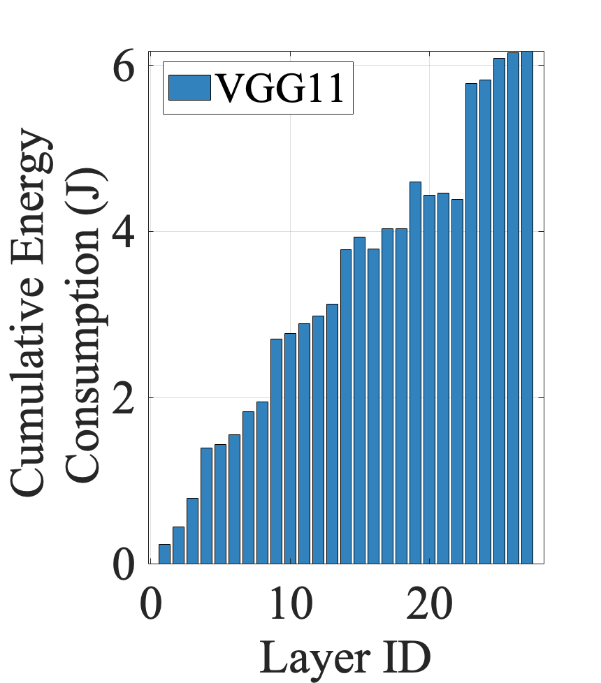
         
        Figure 1: VGG11 Cume
    

    

        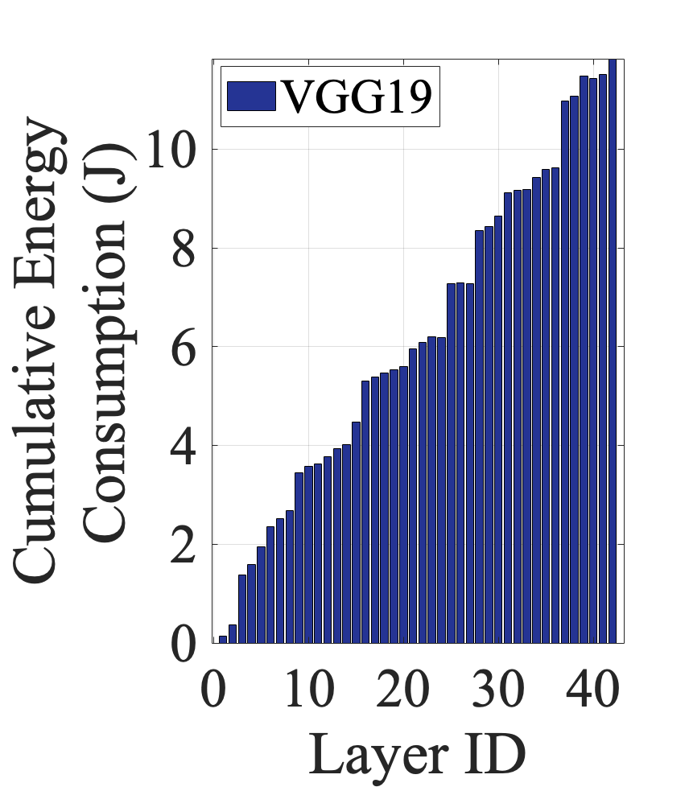
         
        Figure 2: VGG19 Cume
    

    

        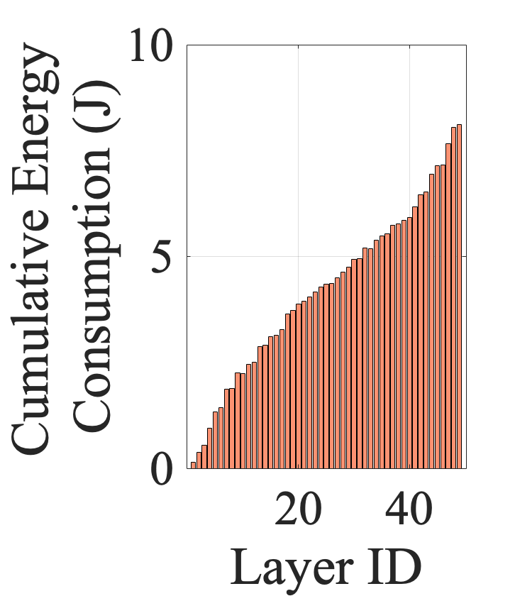
         
        Figure 3: ResNet18 Cume
    

    

        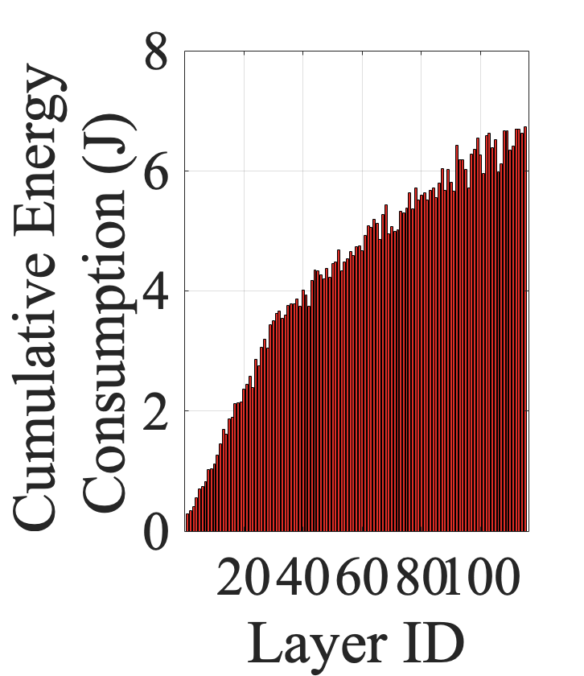
         
        Figure 4: ResNet50 Cume
    

    

        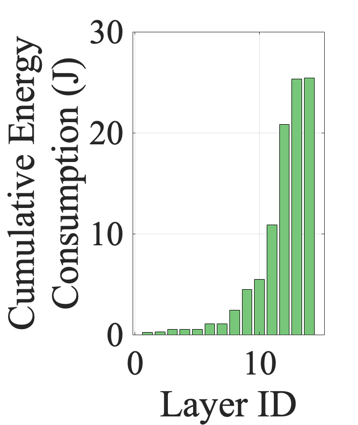
         
        Figure 5: DenseNet121 Cume
    

    

        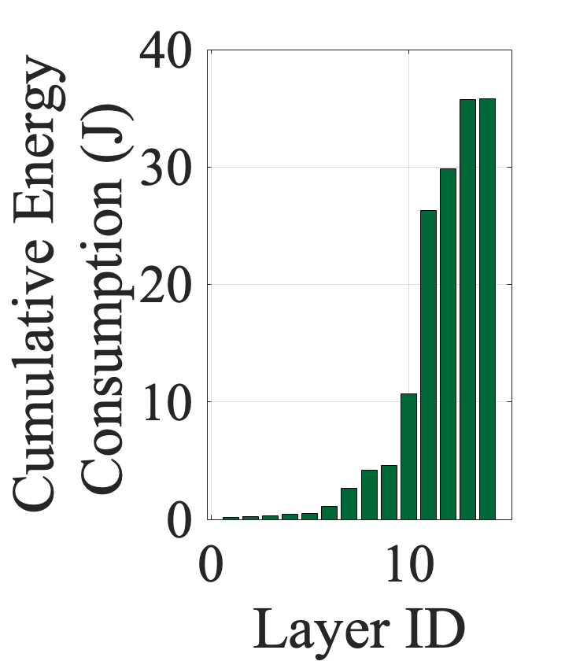
         
        Figure 6: DenseNet161 Cume
    

**Figure: Layerwise device energy consumption comparisons of different versions of VGG, ResNet, and DenseNet**

## Observations on DNN Partitioning

Next, we measure end-to-end latency and energy consumption for all layers of the DNNs. End-to-end latency involves processing the initial part of the DNN, including the cut point layer, on the IoT device, transmitting the output of the cut point layer wirelessly, and subsequently resuming the inference task to the final layer on the server. For end-to-end latency, we exclude server energy consumption. Figures 7 summarize the end-to-end latency and energy consumption of VGG19 over 8 Mbps and 20 Mbps transmission speeds, simulating LTE and WiFi connectivity. 

For VGG11, the optimal cut points in terms of end-to-end latency are layers 21 and 22. However, in terms of energy consumption, layers 6 and 3 are the best for 8 Mbps and 20 Mbps transmission speeds, respectively. Similarly, for VGG19, the optimal cut points in terms of end-to-end latency are 19, 37, and 38 for 8 Mbps, and 10 and 19 for 20 Mbps. However, in terms of energy consumption, layer 5 is the best for both. Comparing the most efficient cut points in terms of energy between versions, we can observe that the best cut point of VGG19 uses almost twice the energy as VGG11.

Considering these observations, we argue that energy-constrained IoT devices, handling latency-sensitive applications, often deal with a trade-off involving end-to-end latency, energy usage, and accuracy. Moreover, the decision on where to make the cut point has a significant impact on both end-to-end latency and energy usage. However, this choice should also take into account the availability of resources for practicality. DNN inference/partitioning allows IoT devices the flexibility to navigate these trade-offs by choosing different versions or cut points.

